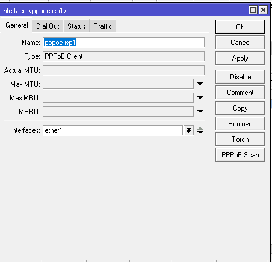
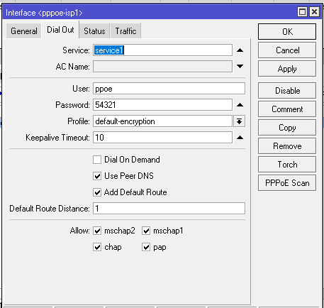

# LAB-37-PPPoE
tanggal 20 agustus 2025 

# Point-to-Point-Protocol-over-Ethernet
PPPOE merupakan sebuah protokol yang mengenkapsulasi frame ke PPP ke dalam Frame ethernet mengunakan MAC Address perangkat. Protokol ini sering digunakan di kalangan ISP untuk mendistribusikan koneksi internet ke pelanggan karna dianggap lebih aman karna selain menggunakan metode autensikasi username dan password untuk bisa terkoneksi, protokol PPPOE juga melakukan enkripsi untuk setiap transaksi data yang dilakukan. PPPOE server juga dapat mendistribusikan alamat IP ke perangkat PPPOE Client secara otomatis layaknya DHCP server melalui koneksi layer2 seperti ethernet, Wire;ess, Fiber OPtik bahkan interface bridge dan juga Tunnel seperti EoIP dan juga VLAN. Kita dapat membuat system database username yang terpusat dengan menafaatkan Radius Server atau pada Mikrotik biasa disebut dengan usermanager. Sehingga kita bisa menangani jumlah user Client yang sangat banyak dengan mudah.

# konfigurasi PPPoE client    
1. masuk ke winbox   
2. pilih mwnu ppp > interface    
3. klik (+)     
4. masukan nama (opsional) lalu pilih interface yang terhubung ke PPPoE servernya.      

5. di tab **Dial out** masukan user dan password yang telah di buat oleh server dan masukakn service name yang di buat oleh server lalu profile arah kan ke **default-encryption.** trus centang use peer DNS.  

6. jika sudah terhubung kita akan mendapat kan ip address secara otomatis    
   dilihat di menu ip > address

7. lalu kita juga dapat ip route     
   bisa di lihat di menu ip > routes

8. dan kita juga dapat DNS secara otomatis    
   cek di menu ip > DNS

9. lalu ping untuk mengetes jaringan internet   

